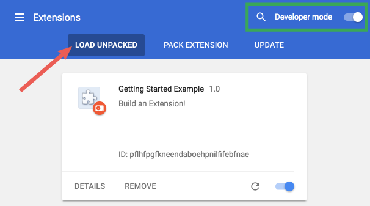

# bilibiliTime
A chrome extension

1. Click the `star` at the top right :) 
2. Download the folder which called bilibiliTime.
3. Open the Extension Management page by navigating to`chrome://extensions`.
   - The Extension Management page can also be opened by clicking on the Chrome menu, hovering over **More Tools** then selecting **Extensions**.
4. Enable Developer Mode by clicking the toggle switch next to **Developer mode**.
5. Click the **LOAD UNPACKED** button and select the extension directory(bilibiliTime).

demo:

